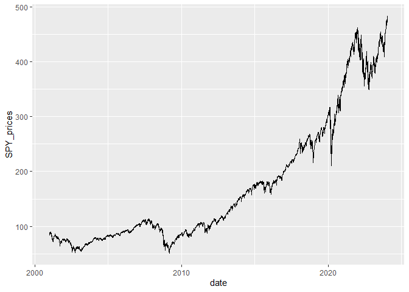
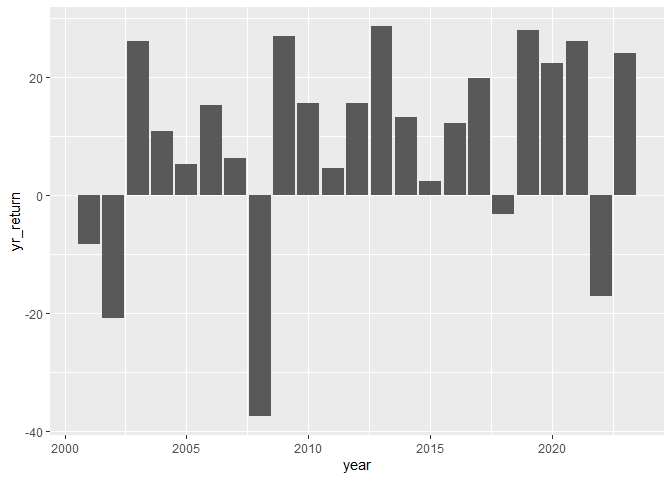

DSE3101_Week2
================
tong
2024-01-24

## Read in data

``` r
df = readRDS("data/wk2_stocks.rds")
str(df)
```

    ## 'data.frame':    5798 obs. of  4 variables:
    ##  $ SPY_prices : num  88.1 87.1 84.3 84.9 84.7 ...
    ##  $ SPY_returns: num  0.04804 -0.01076 -0.03264 0.00774 -0.00264 ...
    ##  $ SPY_vol    : num  88.1 87.1 84.3 84.9 84.7 ...
    ##  $ date       : Date, format: "2001-01-03" "2001-01-04" ...

## Statistics on returns

``` r
sum(df$SPY_returns)*100
```

    ## [1] 218.3304

``` r
mean(df$SPY_returns)*100
```

    ## [1] 0.03765616

``` r
sd(df$SPY_returns)*100
```

    ## [1] 1.221943

- The cumulative returns of the S&P index during this period is 218.33%

- The average daily returns of the S&P index during this period is 0.04%

- The standard deviation of the daily returns of the S&P index during
  this period is 1.22%

## S&P Prices

``` r
library(tidyverse)
```

    ## ── Attaching core tidyverse packages ──────────────────────── tidyverse 2.0.0 ──
    ## ✔ dplyr     1.0.10     ✔ readr     2.1.4 
    ## ✔ forcats   1.0.0      ✔ stringr   1.5.0 
    ## ✔ ggplot2   3.4.1      ✔ tibble    3.1.8 
    ## ✔ lubridate 1.9.2      ✔ tidyr     1.3.0 
    ## ✔ purrr     1.0.1      
    ## ── Conflicts ────────────────────────────────────────── tidyverse_conflicts() ──
    ## ✖ dplyr::filter() masks stats::filter()
    ## ✖ dplyr::lag()    masks stats::lag()
    ## ℹ Use the ]8;;http://conflicted.r-lib.org/conflicted package]8;; to force all conflicts to become errors

``` r
ggplot(data = df, aes(x = date, y = SPY_prices)) +
  geom_line()
```

<!-- -->

``` r
df %>% mutate(year = year(date)) %>%
  filter(year <= 2023) %>%
  group_by(year) %>%
  summarize(yr_return = sum(SPY_returns)*100) %>%
  ggplot(aes(x = year, y = yr_return)) +
  geom_col()
```

<!-- -->
